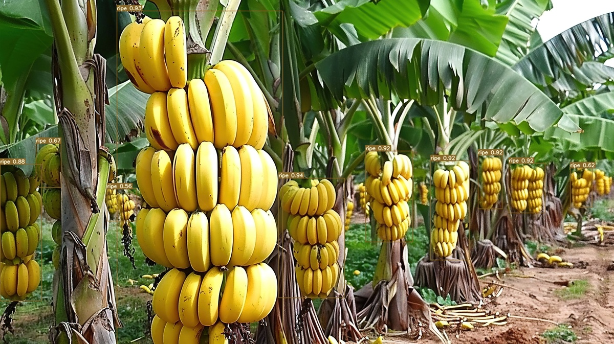

# Towards Automated Agriculture: A Computer Vision Approach for Fruit Ripeness Detection


This project focuses on detecting the ripeness of fruits using object detection models. We compare the baseline **YOLOv7** model with a custom **YOLOv7-BiFPN** model to evaluate performance on a dataset annotated with ripeness labels.

## Objective

To accurately detect and classify fruits (apple, banana, damson plum, mango, and orange) based on their ripeness state (ripe/unripe) using computer vision and deep learning.

---

## Dataset Details

- **Total Images:** 195 (original), augmented to 585
- **Augmentation Techniques:**
  - Horizontal Flip
  - Brightness Adjustment: -25% to +25%
  - Gaussian Blur: up to 2.5px
- **Annotation Format:** YOLO
- **Labeling Strategy:**
  - One kind of fruit per image (can have multiple instances)
  - Fruits: `apple`, `banana`, `damson plum`, `mango`, `orange`
  - Each fruit annotated individually, except bananas (a bunch treated as a single entity)
  - Labels: `ripe`, `unripe`
- **Train/Val Split:** 80:20

---

## Models

### YOLOv7 (Baseline)
- Standard YOLOv7 architecture

### YOLO-BiFPN (Custom)
- Modified **SPPCSPC** module in YOLOv7 head: replaced it with **BiFPN** (Bidirectional Feature Pyramid Network)
- Custom **loss function** including:
  - **Focal Loss**: Addresses class imbalance
  - **Dice Loss**: Improves segmentation and localization accuracy

---

## Hyperparameters & Environment

### Hardware & System

- **Laptop:** Lenovo Legion 5
- **Processor:** AMD Ryzen 7 7940HS
- **RAM:** 16 GB
- **GPU:** 6 GB VRAM (NVIDIA, CUDA enabled)
- **Training Framework:** NVIDIA CUDA Toolkit (for GPU acceleration)

### Hyperparameters (Common to Both Models)

| Parameter      | Value       |
|----------------|-------------|
| Batch Size     | 2           |
| Epochs         | 30          |
| Image Size     | 640 × 640   |
| Optimizer      | SGD (YOLO default) |
| Loss Function  | YOLOv7 default (for baseline) / Custom with Focal + Dice Loss (for YOLO-BiFPN) |
| Augmentations  | Flip, Brightness, Blur (handled via Roboflow) |

> Both models were trained using GPU acceleration powered by NVIDIA CUDA software to optimize training time and performance.

---

## How to run the model

### Training 

Train YOLOv7 with the following command:
```bash
python train.py --img 640 --batch-size 2 --epochs 100 --data ./datasets/dataset/data.yaml --cfg cfg/training/yolov7.yaml --weights yolov7.pt --device 0
```

Train YOLOv7-BiFPN with the following command:
```bash
python train.py --img 640 --batch-size 2 --epochs 100 --data ./datasets/dataset/data.yaml --cfg cfg/training/yolov7-bifpn.yaml --weights yolov7.pt --device 0
```

### Inference
```bash
python detect.py --weights ./runs/train/exp/weights/best.pt --conf 0.25 --source ./inference/images/ --img-size 640 --device 0 --save-txt --save-conf
```
Note: Make sure to replace the path to weights with the latest (or required) exp number.

---

## Results

| Model         | Precision | Recall | mAP@0.5 | mAP@0.5:0.95 | F1 Score |
|---------------|-----------|--------|---------|--------------|----------|
| YOLOv7        | 0.965     | 0.929  | 0.97   | 0.819        | 0.9466   |
| YOLOv7-BiFPN  | 0.982      | 0.969  | 0.984   | 0.868        | 0.9754   |

> **Observation:** The modified YOLO-BiFPN consistently outperforms the baseline YOLOv7 model across all key metrics

---

## Tools & Libraries Used

- YOLOv7 (Ultralytics)
- Roboflow (for labeling & augmentation)
- PyTorch (for model training and inference)

---

## Future Work

- Extend dataset to include more fruit types and ripeness stages
- Explore multi-label classification (e.g. ripe + damaged)

---

## Sample Output 

- Confidence threshold set to 0.7
- YOLOv7


- YOLOv7-BiFPN


- We can see in this example that the modified YOLOv7-BiFPN model is able to detect occluded as well as partially visible fruits precisely, while the base model can not

---

## Acknowledgements

- [YOLOv7 by WongKinYiu](https://github.com/WongKinYiu/yolov7)
- [Roboflow](https://roboflow.com/) for easy dataset handling

---

